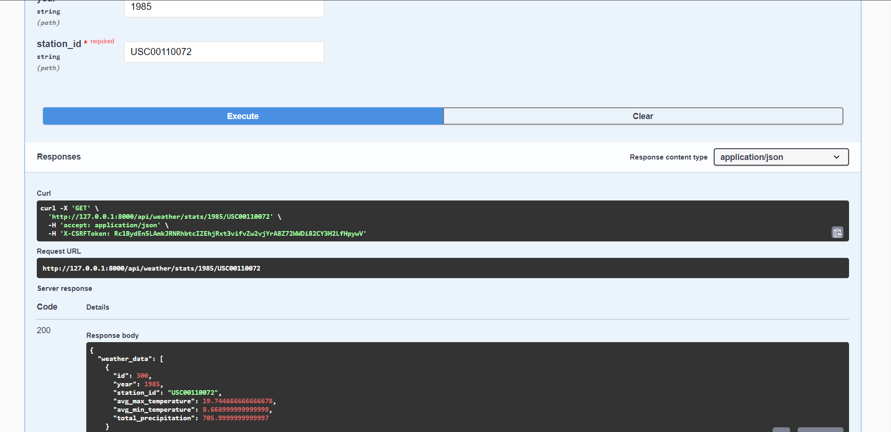

# Weather Stats Project

## Developer Guide

### Prerequisites
- Python 3.x installed
- PostgreSQL installed locally
- Git installed

### Setup Instructions

1. **Clone the Repository:**

2. **Install Python Dependencies:**
    ```
      pip install -r requirements.txt
    ```
   
4. **Setup PostgreSQL Database:**
- Install PostgreSQL and ensure it's running.
- Create a database named `weather`.
- Update the database connection settings (`settings.py`) with your PostgreSQL username, password, and host.

4. **Apply Migrations:**

```
    python manage.py makemigrations
    python manage.py migrate
```


5. **Import Initial Weather Data:**
- Place your weather data files in a directory named `wx_data` within the project root.
- Run the import script to load data into the database:
  ```
  python manage.py runscript import_weather_data
  ```


6. **Create Aggregated Yearly Statistics:**
- Execute the script to generate aggregated yearly statistics:
  ```
  python manage.py runscript create_agg_data
  ```

7. **Run the Development Server:**
```python manage.py runserver```


8. **Access API Documentation:**
- Open your web browser and go to `http://127.0.0.1:8000/swagger/` to view and test the available APIs.


### Additional Notes

- Make sure all dependencies are installed and PostgreSQL is properly configured before running the setup.
- Adjust database settings (`settings.py`) according to your PostgreSQL configuration.
- Ensure your weather data files are correctly formatted and placed in the `wx_data` directory before importing.
- For any issues or questions, refer to the project's documentation or contact the project maintainers.


